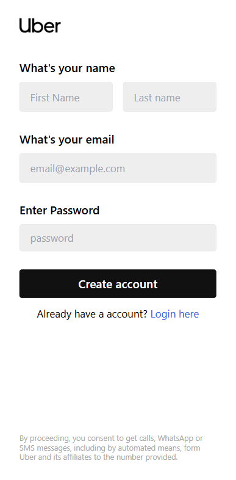
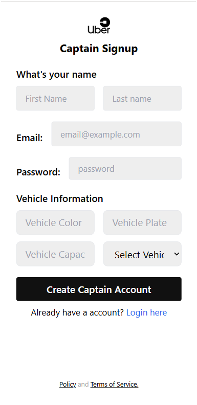
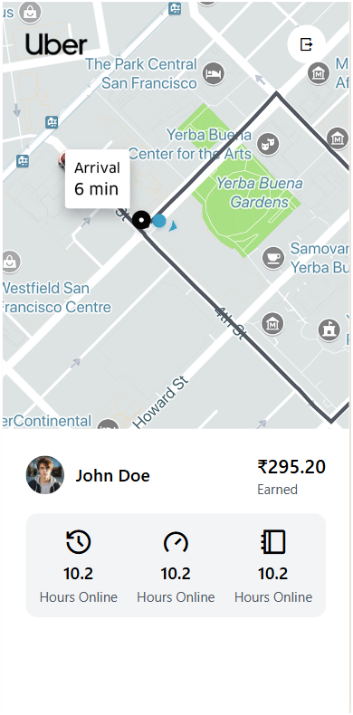
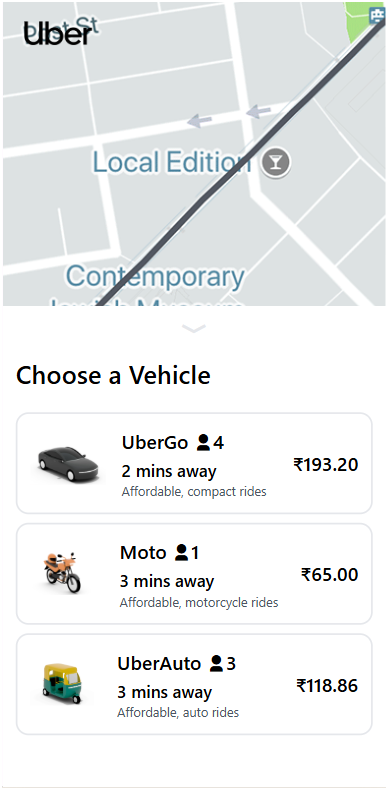
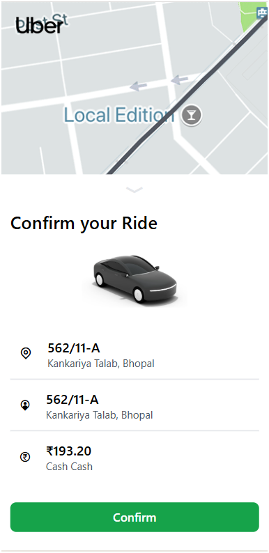

# 🚖 Uber Clone – Full Stack MERN Application

A full-stack **Uber-like ride booking platform** built with **React, Node.js, Express, and MongoDB**, featuring user & captain authentication, ride flow UI, and real-world deployment.

🔗 **Live App:** https://uberclone-bice.vercel.app  
🔗 **Backend API:** https://uber-clone-qbbb.onrender.com  

---

## 📸 Screenshots

### User Authentication


### Captain Signup


### Captain Dashboard


### Vehicle Selection


### Confirm Ride


---

## ✨ Features

### 👤 User
- User signup & login (JWT authentication)
- Add pickup & destination
- Choose vehicle type (UberGo, Moto, Auto)
- Confirm ride

### 🧑‍✈️ Captain
- Captain registration with vehicle details
- Secure authentication
- Dashboard with earnings & online hours

### 🔐 Authentication
- JWT-based authentication
- Protected routes
- Password hashing using bcrypt

---

## 🛠️ Tech Stack

### Frontend
- React (Vite)
- JavaScript
- Axios
- Tailwind

### Backend
- Node.js
- Express.js
- MongoDB Atlas
- Mongoose
- JWT
- bcrypt

### Deployment
- Frontend: **Vercel**
- Backend: **Render**
- Database: **MongoDB Atlas**

---

## 🧱 Project Structure

```bash
Uber-Clone/
│
├── frontend/        # React frontend (Vite)
│   ├── src/
│   ├── public/
│   └── package.json
│
├── Backend/         # Node.js backend
│   ├── routes/
│   ├── models/
│   ├── controllers/
│   ├── db/
│   ├── app.js
│   └── server.js
│
└── README.md


## ⚙️ Environment Variables

Create the following `.env` files before running the project locally.

### Frontend (`frontend/.env`)
```env
VITE_BASE_URL=http://localhost:4000


### Backend (`Backend/.env`)
```env
PORT=4000
DB_CONNECT=your_mongodb_atlas_uri
JWT_SECRET=your_secret_key

### Clone repository

git clone https://github.com/adarsh0627/Uber-Clone.git
cd Uber-Clone

### Start Backend
- cd Backend
- npm install
- npm start

### Start frontend
- cd frontend
- npm install
- npm run dev

